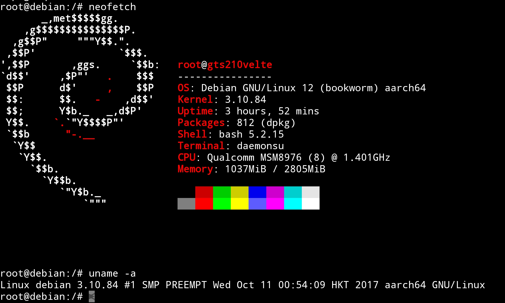

# DebDroid - Debian On Android

> [!WARNING]
> This project only supports `aarch64`. It will terminate immediately if run on a different architecture.

> [!WARNING]
> This project is intended for Android devices running Linux kernel `3.10` or later (released December 2017). Older kernels are likely to cause major issues and are unsupported.

DebDroid provides a lightweight and minimal Debian chroot environment for Android devices. It manages an isolated, native Debian, Linux-like userland without depending on Termux or additional user-space layers. It's ideal for power users, developers, and tinkerers who want to run a sandboxed Debian environment as close to the actual Android system.



## DebDroid is not Termux

Unlike Termux or Proot, which run Linux tools via Android-compiled binaries or user-space emulation, DebDroid runs a real Debian chroot directly on Android. It ships its own programs, libraries, patches and links key Android filesystems into the Debian environment, providing near-native Linux functionality and the ability to run almost any Debian-compatible program.

## Features

- Small and portable.
- No external dependencies.
- Runs a minimal Debian Linux userland in a isolated chroot environment.
- Mounts key Android system paths to provide near-native Linux functionality.
- Employs `unshare` to isolate Android mountpoints from the chroot environment.
- Supports `/dev` overlayfs, creating a writable layer over device files without modifying the real `/dev`.

## Requirements

- A rooted Android device.
- A minimum 1-5GB of available storage space.

## Disclaimer

The software is provided "as is", without warranty of any kind, express or implied, including but not limited to the warranties of merchantability, fitness for a particular purpose, and noninfringement. In no event shall the authors or copyright holders be liable for any claim, damages, or other liability, whether in an action of contract, tort, or otherwise, arising from, out of, or in connection with the software or the use or other dealings in the software.

## Security implications

### RNG and Cryptography

This project patches certain system utilities, providing compatibility with the Android system by overriding Linux's randomness mechanisms, such as the `getrandom` syscall, `getentropy` function and glibc’s `arc4random` functions. It replaces the default cryptographic randomness with direct `/dev/urandom` reads. This is generally safe on modern Linux/Android, because the kernel ensures `/dev/urandom` provides high-quality entropy.

## Installation Guide

This guide is written for novice users. You only need basic knowledge of Android, like installing apps from unknown sources, extracting an archive, and a little experience using a terminal (command line).

### What You Need

Before starting, make sure you have these apps installed on your device:

- [Terminal Emulator](apk/TerminalEmulator.apk) - lets you access Android's command-line interface.
- [Hacker's Keyboard](apk/HackersKeyboard.apk) - an advanced keyboard that makes typing commands easier.
- [Root Explorer](https://play.google.com/store/apps/details?id=com.speedsoftware.rootexplorer&hl=en-US) - lets you browse and manage Android files.

Alternatively, you can use a free alternative to Root Explorer, such as [Explorer](https://play.google.com/store/apps/details?id=com.speedsoftware.explorer&hl=en-US) or [MiXplorer](https://play.google.com/store/apps/details?id=com.mixplorer.silver).

### Step 1: Downloading and Extracting the Project

1. Download the project zip file: [DebDroid-main.zip](https://github.com/NICUP14/DebDroid/archive/refs/heads/main.zip).
2. Locate `DebDroid-main.zip` in your `Download` folder (`/sdcard/Download`).
3. Extract the `DebDroid-main.zip` archive inside the `Download` folder. You can use an application such as `Root Explorer` or `MiXplorer` for this task.

After extraction, you should have a folder named `DebDroid-main` in your `Download` folder.

### Step 2: Installing DebDroid

1. Open the `Terminal Emulator` app.
2. Type the following commands, pressing Enter after each one:

```bash
su
cd /sdcard/Download/DebDroid-main
sh install.sh
```

The script will automatically install DebDroid files in:

- `/data/local/debdroid`
- `/sdcard/debdroid`

After that, DebDroid is ready to use!

## Quickstart Guide

### Usage

To display DebDroid's help page, run:

```bash
/sdcard/debdroid/debdroid.sh help
```

```txt
Usage:
  debdroid.sh [OPTION] [SUBOPTION] [ARGUMENTS]

Options:
  run [COMMAND...]
      Runs the default Debdroid environment.
      If COMMAND is provided, it executes that command inside the environment.
      If no command is given, an interactive shell is started.

  list [patch|command]
      Lists available scripts.
      patch   - Lists all patch scripts in the patch directory.
      command - Lists all command scripts in the command directory.

  patch [PATCH_NAME]
      Applies the specified patch script from the patch directory.
      Example: debdroid.sh patch fix_network

  command [COMMAND_NAME]
      Executes the specified command script from the command directory.
      Example: debdroid.sh command setup_user

  resize (+|-)[SIZE]
      Resizes the debian image relative to the specified size.
      Example: debdroid.sh resize +2G

Notes:
  - Unrecognized options are treated the same as the 'run' option.
```

### DebDroid Hierarchy

```txt
/sdcard/debdroid/
├── debdroid_env.sh   # Config script (paths, environment variables)
├── debdroid.sh       # Control script
├── debdroid_mgr.sh   # Backend script (mounts and manages chroot)
├── img/
│   └── debian.img    # Debian root filesystem
├── patch/            # Patch scripts
└── command/          # Command scripts
```

Scripts placed in `patch` provide easy-to-apply fixes and tweaks for the environment's misbehaving. For more information, check out the [patching section](#patching). The ones placed in the `command` folder can be easily executed to conduct specific tasks within the chroot environment, such as updating the system or managing ssh & vnc servers (coming soon!). Consult the [running commands section](#running-commands).

```txt
/data/local/debdroid/
├── bin   # External binaries
├── lib   # External libraries
└── mnt   # Debian mount point
```

Programs stored in `bin` can be run directly inside the chroot as it is mounted and appended to `$PATH`. Libraries placed inside `lib` will be automatically preloaded, allowing for custom overrides and patches without any modifications to Linux system files.

### Running Interactive Sessions

1. Open the `Terminal Emulator` app.
2. Type the following commands, pressing Enter after each one:

```bash
su
sh /sdcard/debdroid/debdroid.sh
```

This launches the environment and gives you a shell inside Debian.

Inside the chroot shell, users can execute the `exit` command to leave the environment and automatically unmount the filesystems.

### Running Commands

You can run a specific command inside the chroot without starting an interactive shell. DebDroid provides pre-made command scripts located in `/sdcard/debdroid/command`, which automate common tasks such as maintenance, setup, or service management.

To list available command scripts, run:

```bash
su
sh /sdcard/debdroid/debdroid.sh list command
```

To execute a command script, run:

```bash
su
sh /sdcard/debdroid/debdroid.sh command <command-name>
```

To execute other commands directly inside the chroot, run:

```bash
su
sh /sdcard/debdroid/debdroid.sh apt update
# or (explicit version)
sh /sdcard/debdroid/debdroid.sh run apt update
```

This will execute the `apt update` command directly in the chroot environment.

## Patching

If certain utilities or packages don’t work correctly inside the chroot, you can apply the provided patch scripts located in /sdcard/debdroid/patch. These scripts fix common issues, such as networking problems or other environment-specific quirks.

To list all available patches, run:

```bash
su
sh /sdcard/debdroid/debdroid.sh list patch
```

To apply a patch, run:

```bash
su
sh /sdcard/debdroid/debdroid.sh patch <patch-name>
```

## Notes

### Image Resizing

The Debian root filesystem (debian.img) in DebDroid has a fixed size. If you need more space, you can easily expand it using the built-in resize helper.

The following command expands the debian environment by 500MB:

```bash
su
sh /sdcard/debdroid/debdroid.sh resize +500M
```

For additional usage instructions, run:

```bash
su
sh /sdcard/debdroid/debdroid.sh resize
```

- Make sure the image is **not mounted** when resizing.
- Ensure you have **enough free storage** on your device to accommodate the new image size.

### Patching Apt

The `_apt` user is responsible for managing package downloads and upgrades inside the chroot. By default, it does not have network access due to Android group restrictions. This can cause errors during `apt update` or `apt upgrade`. Fix the issue by applying the `apt.sh` patch:

```bash
su
sh /sdcard/debdroid/debdroid.sh patch apt
```

After running this, the `_apt` user will have the necessary permissions to perform system upgrades without errors.

### User Networking

Due to Android group restrictions, users inside the DebDroid chroot need to be added to the `inet` group to access networking tools.

```bash
groupadd -g 3003 inet
usermod -aG inet <username>
```

After this, the user should be able to use networking commands like `ping`.

## Patched Programs

The following programs have been analyzed and patched to run properly within the DebDroid chroot environment:

- `gpg` – GNU Privacy Guard
- `sshd` – OpenSSH server
- `xfce4` - XFCE4 desktop environment (coming soon!)
